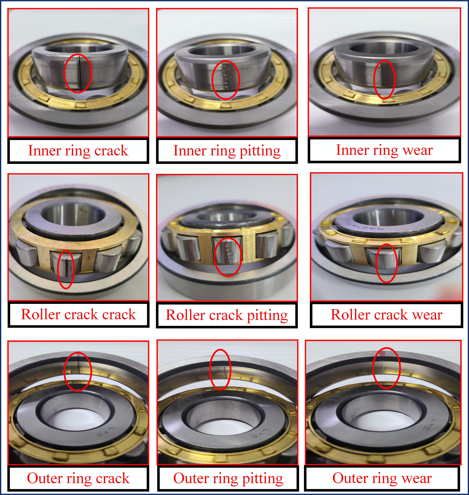

# AHU Parabolic Acoustic Mirror Bearing Dataset

We have released an open-source, dual-acquisition acoustic dataset for rolling bearing fault diagnosis. 

We hope this dataset can benefit your research in condition monitoring and signal processing.

**Data on Google Drive:** [Insert Link Here]
**Data on Quark Netdisk:** [Insert Link Here]

**The following is a brief introduction to the dataset. For more detailed information, please refer to the dataset specification file.**

---

## Dataset Overview

This dataset includes acoustic signals from nine rolling bearings with three fault locations and three fault types, collected under various operating conditions. All data are clearly labeled with corresponding fault types and working conditions. 

A unique feature of this dataset is that the acoustic signals were acquired simultaneously using two distinct methods:
* **PM:** With a parabolic acoustic mirror.
* **DM:** With direct microphone acquisition.

These datasets are publicly available, and anyone can use them to validate acoustic fault diagnosis algorithms. Publications making use of the PAM-Bearing dataset are requested to cite the following paper:

**L. Peng, F. Liu, M. Xia, C. Shen, Q. He, and Y. Liu, Parabolic Acoustic Mirror: Utilize the shape of its own housing to improve the online monitoring accuracy of rotating electromechanical equipment. IEEE Transactions on Industrial Electronics, 202x.**

---

## Brief Introduction to Experiments

### Experimental Platform

Fig. 1. Acoustic mirror test bench.

Fig. 2. Test bearing in different health conditions.

To verify the feasibility of using a parabolic acoustic mirror for focused acoustic signal acquisition, the mirror was mounted at the shaft end in place of the traditional bearing end cap. This setup enabled the collection of acoustic signals from faulty bearings during operation.

The experimental platform consisted of a base frame, a three-phase asynchronous motor, a Siemens frequency converter, and a custom bearing end-cap testing assembly. The testing assembly integrated the supporting bearing, test bearing, hydraulic loading device, parabolic acoustic mirror, acceleration sensors, and other relevant sensors. 

### Operating Conditions

The radial load is applied through a hydraulic loading system. To avoid directly stressing the test bearing, the applied pressure is transmitted to the housing of the centrally positioned supporting bearing. Rotational speed is controlled via the Siemens frequency converter. 

The experimental operating conditions include:
* **Radial Load:** 5 KN (labeled as L05).
* **Rotational Speeds:** 600 rpm, 900 rpm, and 1200 rpm.

### Sampling Setting

Each folder contains multiple samples in .mat format, recorded at a sampling rate of 20,000 Hz, with each sample lasting 25 seconds.

---

## Dataset Details

### Folder Structure

The dataset is organized into two main folders: PM (parabolic mirror) and DM (direct microphone). Each folder contains subfolders for three fault locations and healthy bearings. Within each fault location folder, data are further divided into three fault types, and each fault type folder contains recordings at three different rotational speeds. All data are stored in .mat format.

### File Naming Convention

The .mat file names are defined according to specific labels. For example, the filename `DM_L05_r600_B02` indicates a Direct Microphone acquisition, 5 KN load, 600 rpm, with a Ball crack fault.

The labels are represented by the following codes:
* **Acquisition Method:** `PM` (Parabolic Mirror) or `DM` (Direct Microphone).
* **Fault Location:** `B` (Ball), `IR` (Inner ring), `OR` (Outer ring).
* **Fault Type:** `01` (Pitting), `02` (Crack), `03` (Wear).

---

## Equipment Specifications

The parameters of the faulty bearings and the parabolic acoustic mirror are shown in Tables 1 and 2, respectively.

**Table 1. Bearing Parameters of LYC N/NU407ECM**
| Parameter | Value |
| :--- | :--- |
| Inner raceway diameter | 54 mm |
| Outer raceway diameter | 83 mm |
| Pitch diameter | 68.5 mm |
| Number of balls | 11 |
| Ball diameter | 15 mm |
| Contact angle | 0° |

**Table 2. Specification parameters of parabolic acoustic mirror**
| Parameter | Value |
| :--- | :--- |
| Parabolic equation | $y^2=90x$ |
| Material | Aluminum alloy |
| Focal length | 22.5 mm |
| Depth | 22.5 mm |
| Thickness | 7 mm |
| Aperture diameter | 90 mm |

---

## Contact

If you have any questions or suggestions, do not hesitate to contact:

Mr. Linhao Peng, plh1359020260@163.com
